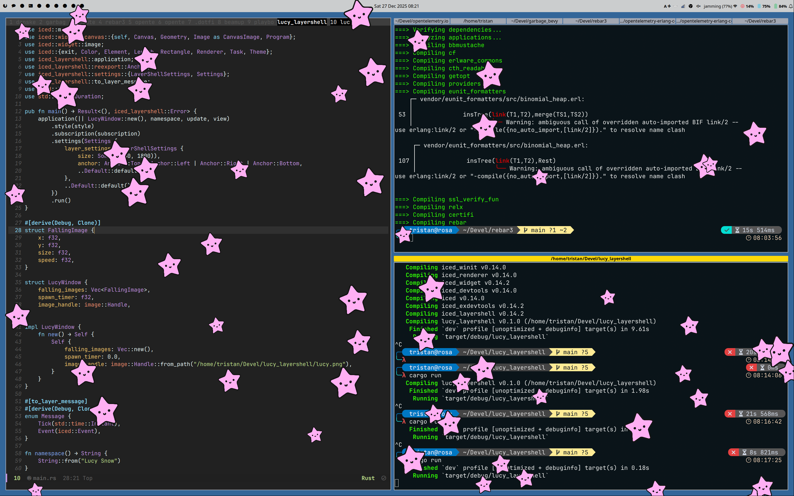

# Lucy Snow

Another experiment in "vibecoding" seeing how it could do with something fairly
obscure like iced layershell. Though there are a fair number of examples on
Github it turned out.

NOTE: It is currently hard-coded to my screen resolution of (2880, 1800) in
multiple places.

A Wayland layer-shell application that displays falling Lucy starfish images across your screen, creating a fun "snow" effect.

Built with [iced](https://iced.rs/) and [iced_layershell](https://github.com/waycrate/exwlshelleventloop).



## Features

- Transparent overlay that sits on top of all windows
- Animated falling starfish images with random sizes and speeds
- Press **Escape** to exit

## Requirements

- Wayland compositor with layer-shell support (e.g., Sway, Hyprland, KDE Plasma)
- Rust toolchain

## Building

```bash
cargo build --release
```

## Running

```bash
cargo run --release
```

## License

MIT
